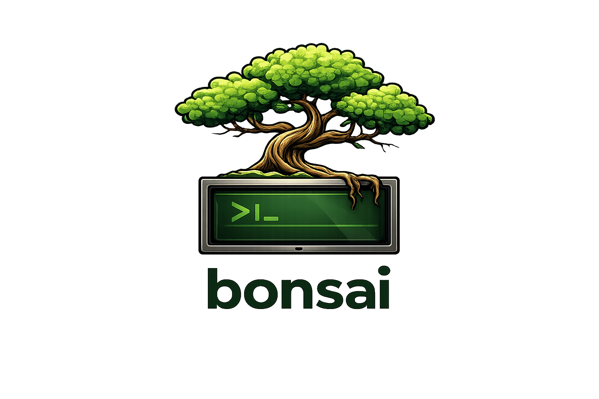

# 🎋 bonsai

<div align="center">
  
</div>

> Carefully cultivate your branches.

A Git worktree workflow CLI that lets you work on multiple branches simultaneously without the context-switching pain.

## Why bonsai?

**The problem:** You're deep in a feature branch when an urgent bug comes in. Now you need to:
```bash
git stash
git checkout main
git pull
git checkout -b hotfix/urgent
# ... fix the bug ...
git checkout feature/my-work
git stash pop
# Hope nothing conflicts...
```

**With bonsai:**
```bash
bonsai grow hotfix/urgent
# Fix bug in a completely isolated environment
# Your feature branch is untouched, editor still open
bonsai prune hotfix/urgent
```

Each worktree is a fully independent working directory with its own `node_modules`, build artifacts, and editor state. No stashing. No conflicts. No mental overhead.

## Installation

### Quick install

Install the latest release binary directly:

```bash
curl -fsSL https://raw.githubusercontent.com/abhinavramkumar/bonsai/main/install.sh | sh
```

Or download manually from [GitHub Releases](https://github.com/abhinavramkumar/bonsai/releases).

### Homebrew (macOS/Linux)

```bash
brew install abhinavramkumar/bonsai/bonsai
```

### From source (requires [Bun](https://bun.sh))

```bash
git clone https://github.com/abhinavramkumar/bonsai.git
cd bonsai
bun install
bun run build
sudo cp ./dist/bonsai /usr/local/bin/
```

### Shell integration (recommended)

For tab completion and the `switch` command:

```bash
bonsai completions
# Interactive setup - adds to ~/.zshrc or ~/.bashrc
```

Or manually:
```bash
# Add to your shell config
eval "$(bonsai completions zsh)"  # or bash
```

## Quick Start

```bash
# 1. Initialize in your repo
cd ~/Projects/myapp
bonsai init

# 2. Create a worktree for a branch
bonsai grow feature/auth
# → Fetches latest from remote
# → Creates ~/Projects/myapp.worktrees/feature-auth
# → Runs your setup commands (npm install, etc.)
# → Opens in your editor

# 3. Work on multiple things at once
bonsai grow hotfix/security    # Another worktree, another editor window
bonsai list                    # See all active worktrees

# 4. Switch between worktrees (requires shell completions)
bonsai switch feature-auth     # cd to that worktree

# 5. Clean up when done
bonsai prune feature/auth      # Safely removes worktree (prompts if dirty)
```

## Commands

| Command | Aliases | Description |
|---------|---------|-------------|
| `bonsai init` | | Interactive setup wizard for current repo |
| `bonsai grow <branch>` | `add`, `new` | Create worktree, run setup, open editor |
| `bonsai prune <branch>` | `rm`, `remove` | Remove worktree (prompts if uncommitted changes) |
| `bonsai list` | `ls` | List all worktrees |
| `bonsai switch <name>` | | cd to worktree *(requires shell completions)* |
| `bonsai setup` | | Re-run setup commands in current worktree |
| `bonsai config` | | Open config in `$EDITOR` |
| `bonsai completions` | | Install shell integration |

## How `grow` Works

When you run `bonsai grow feature/auth`:

1. **Validates** the branch name (rejects invalid characters, names starting with `-`)
2. **Fetches** latest from remote (`git fetch --all --prune`)
3. **Detects** branch status:
   - Remote-only branch → tracks `origin/feature/auth`
   - Existing local branch → uses it
   - New branch → creates from current HEAD
4. **Checks** if branch is already checked out elsewhere
   - If in another worktree that exists → error with location
   - If stale reference (deleted directory) → offers to prune
5. **Creates** the worktree at `<worktree_base>/feature-auth`
6. **Opens** your configured editor
7. **Runs** setup commands sequentially (stops on first failure)

## How `prune` Works

When you run `bonsai prune feature/auth`:

1. **Finds** the worktree at `<worktree_base>/feature-auth`
2. **Checks** for uncommitted changes (`git status --porcelain`)
3. **If dirty:** Shows changed files and asks for confirmation
4. **Removes** the worktree (`git worktree remove`)

The branch itself is **not deleted** - only the worktree directory.

## Configuration

Config lives at `~/.config/bonsai/<repo-name>.toml` (XDG compliant):

```toml
[repo]
path = "/Users/you/Projects/myapp"
worktree_base = "/Users/you/Projects/myapp.worktrees"

[editor]
name = "cursor"  # cursor | vscode | claude

[setup]
commands = [
  "npm install",
  "cp .env.example .env",
  "npm run db:migrate"
]
```

Edit directly or run `bonsai config` to open in your editor.

### Setup Commands

Setup commands run sequentially in the new worktree after creation:

- **Streamed output** with colors preserved
- **Fail-fast** - stops on first non-zero exit code
- **Retryable** - run `bonsai setup` to retry after fixing issues
- **Uses `set -e`** - compound commands (`cmd1; cmd2`) fail properly

Examples:
```toml
# Node.js project
commands = ["npm install", "npm run build"]

# Python project  
commands = ["python -m venv .venv", "source .venv/bin/activate && pip install -e ."]

# Monorepo with multiple package managers
commands = [
  "npm install",
  "cd packages/frontend && npm install",
  "cd packages/backend && pip install -r requirements.txt"
]

# Copy environment files
commands = [
  "cp .env.example .env",
  "cp .env.test.example .env.test"
]
```

## Branch → Folder Mapping

Branch names are sanitized for folder names (slashes become dashes):

| Branch | Folder |
|--------|--------|
| `feature/user-auth` | `feature-user-auth` |
| `hotfix/critical-bug` | `hotfix-critical-bug` |
| `release/v2.0` | `release-v2.0` |
| `my-branch` | `my-branch` |

## Supported Editors

| Editor | CLI Command | Config Value |
|--------|-------------|--------------|
| Cursor | `cursor` | `cursor` |
| VS Code | `code` | `vscode` |
| Claude Code | `claude` | `claude` |
| GoLand | `goland` | `goland` |
| RustRover | `rust-rover` | `rust-rover` |
| Webstorm | `webstorm` | `webstorm` |
| PyCharm | `pycharm` | `pycharm` |

The editor opens immediately after worktree creation (doesn't wait for setup to complete).

## Shell Integration

Running `bonsai completions` adds:

- **Tab completion** for all commands
- **Branch completion** for `grow` (from local and remote git branches)
- **Worktree completion** for `prune` and `switch`
- **`bonsai switch`** command to cd into worktrees

```bash
bonsai grow feat<TAB>        # completes to feature/...
bonsai prune <TAB>           # shows existing worktrees
bonsai switch <TAB>          # shows existing worktrees
```

The `switch` command requires shell integration because a subprocess cannot change the parent shell's directory.

## Example Workflow

```bash
# Morning: Start feature work
cd ~/Projects/myapp
bonsai grow feature/payments
# Editor opens with fresh environment, setup runs

# Afternoon: Urgent hotfix needed
bonsai grow hotfix/security-fix
# New editor window opens
# Original feature worktree is completely untouched

# Fix the bug, commit, push, merge...

# Clean up hotfix
bonsai prune hotfix/security-fix

# Back to feature (if you have shell completions)
bonsai switch feature-payments

# Or just use your editor's window switching
```

## Handling Edge Cases

### Branch already checked out elsewhere

```
Branch feature/auth is already checked out at:
  /Users/you/Projects/myapp.worktrees/feature-auth

Either use that worktree or check out a different branch there first.
```

### Stale worktree reference

If a worktree directory was deleted manually (not via `bonsai prune`), git still tracks it:

```
Branch feature/auth has a stale worktree reference at:
  /Users/you/Projects/myapp.worktrees/old-path (directory no longer exists)

? Prune stale worktree references and continue? (Y/n)
```

### Uncommitted changes on prune

```
Uncommitted changes detected:
  modified   src/index.ts
  added      src/new-file.ts
  untracked  temp.log

? Force delete worktree with 3 uncommitted change(s)? (y/N)
```

## Tips

- **Keep worktree base outside your repo** - The default `<repo>.worktrees` sibling directory keeps things organized
- **Use descriptive branch names** - They become folder names, making `bonsai list` output readable
- **Add `.worktrees` to global gitignore** - Prevents accidentally committing worktree directories
- **Setup commands should be idempotent** - They may run multiple times via `bonsai setup`

## Development

```bash
bun run dev -- --help    # Run without compiling
bun run build            # Compile to ./dist/bonsai
bun run typecheck        # Type check
bun run format           # Format code with Prettier
bun run format:check     # Check code formatting
bun run hooks:install    # Install git pre-commit hook
bun run link             # Symlink to /usr/local/bin (for testing)
bun run unlink           # Remove symlink
```

### Git Hooks

A pre-commit hook automatically formats staged files before each commit. Install it with:

```bash
bun run hooks:install
```

Or manually:
```bash
./scripts/install-hooks.sh
```

## Architecture

```
src/
  cli.ts              # Entry point, command routing
  commands/
    init.ts           # Interactive setup wizard
    grow.ts           # Create worktree + setup + editor
    prune.ts          # Remove worktree with safety checks
    list.ts           # List worktrees
    setup.ts          # Re-run setup commands
    config.ts         # Open config in $EDITOR
    completions.ts    # Shell integration (zsh/bash)
  lib/
    config.ts         # TOML config management
    git.ts            # Git operations
    editor.ts         # Editor launching
    runner.ts         # Command execution with streaming
```

## Requirements

| Requirement | Details |
|-------------|---------|
| **OS** | macOS, Linux |
| **Git** | 2.5+ (worktree support) |
| **Runtime** | [Bun](https://bun.sh) (for building from source) |
| **Editor** | Cursor, VS Code, or Claude Code |

## License

MIT
